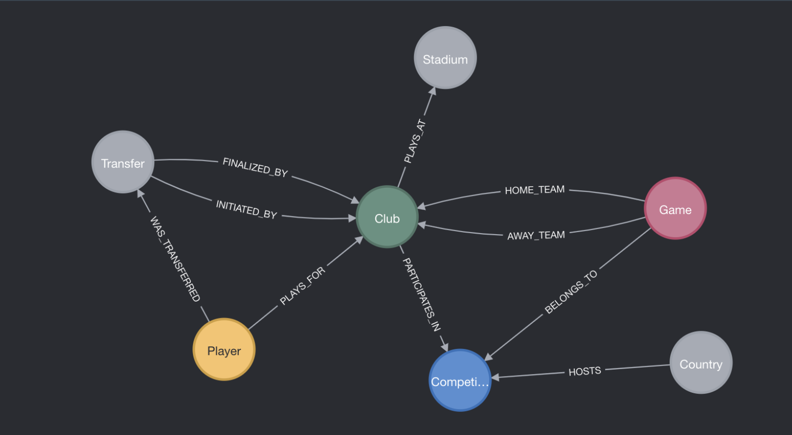

# Neo4j Football Graph

## Overview
This project builds a property graph in Neo4j from a rich football dataset. You will find:
- **Data model & import**: CSV→PostgreSQL→export to CSV→bulk-import into Neo4j via Cypher (`cypher_part.cyp`).
- **Python ETL scripts**:  
  - `script_players.py`, `script_clubs.py`, `script_games.py`, `script_transfers.py`  
    clean and export raw CSV files into Neo4j‑ready CSVs.  
- **Schema & constraints**:  
  Defined in `tables.sql` for the relational staging, and enforced in Neo4j via indexes/constraints in `cypher_part.cyp`.
- **Cypher queries**:  
  A curated set of example queries showcasing negative-pattern filters, `OPTIONAL MATCH`, quantified patterns, use of `WITH`, `COLLECT`/`UNWIND`, list predicates, and post‑`UNION` filters.
- **Graph Data Science demos**:  
  Executables in `neo4j_demo.ipynb` illustrating PageRank, Louvain, projections, and comparisons with equivalent SQL.
- **Flask demo app**:  
  `app.py` exposes REST endpoints to trigger GDS algorithms and retrieve results as JSON.

## Dataset
We leverage the “Player Scores” dataset from Kaggle:  
https://www.kaggle.com/datasets/davidcariboo/player-scores/data

## Technologies
- **Neo4j** (graph database, Cypher)  
- **Python 3**  
- **neo4j‑driver**  
- **Flask** (micro web framework)  
- **Jupyter Notebook** (for demos)


## Setup & Usage

1. **Install Python dependencies**  
   ```bash
   pip install neo4j flask pandas
    ```
2. **Generate Neo4j‑ready CSVs**
    ```bash
    python script_players.py
    python script_clubs.py
    python script_games.py
    python script_transfers.py
    ```
3. **Import into Neo4j**
    - Place the CSV files in the `import` folder
    - Open the Neo4j Browser and run the querys on top of `cypher_part.cyp`

4. **Explore with Cypher**
    - Try example queries in `cypher_part.cyp`

5. **Run GDS demos**
    - Open `neo4j_demo.ipynb` and execute cells to project graphs, run PageRank & Louvain, and visualize results.

6. **Start the Flask API**
    ```bash
    python app.py
    ```
    - Endpoints available at `http://localhost:5000/…`, e.g. `/clubs/pagerank`.

## Neo4j graph data model

